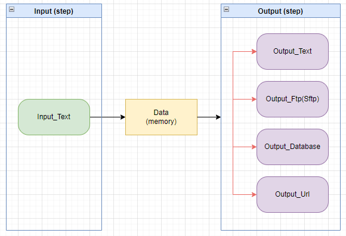

# LogParsing_regex

파일안에 존재하는 데이터를 정규식으로 추출하여 원하는 형태의 포맷으로 데이터를 변환하는 툴이다.

추출된 데이터 형태는 블럭을 기준으로 테이블(table) 형태의 데이터 포맷을 추출할수 있다.( table(추출데이터) = ROW[num][태그명] )

아래 형태로 파일안에 데이터가 존재한다면,

-------------------------------------
```
블럭 1
    * 필드_1
    * 필드_2
    * 필드_3
    * 필드_4
    * 필드_5
```
-------------------------------------
```
블럭 2
    * 필드_1
    * 필드_2
    * 필드_3
    * 필드_4
    * 필드_5
```
-------------------------------------

```
파싱 결과물 (메모리) => 정규식을 통한 추출된 태그 결과물(자료구조는 맵형태)
    ${필드_1},${필드_2},${필드_3},${필드_4},${필드_5}
    ${필드_2},${필드_2},${필드_3},${필드_4},${필드_5}
```

저장 포맷을 ${필드_5},${필드_4},${필드_3},${필드_2},${필드_1} 로 한다면, 아래와 같이 결과물을 얻을 수 있다 

```
저장된 text 내용
    필드_5,필드_4,필드_3,필드_2,필드_1
    필드_5,필드_4,필드_3,필드_2,필드_1
```

netflow_sample.txt 은 netflow 프로토콜의 샘플 데이터이며, genrator 툴을 이용한 가상 데이터이다.
이 툴을 이용하면, 추출한 데이터를 태그화 시킬수 있으며, 이 태그를 조합하여 새로운 형태의 파일로 결과를 저장할 수 있다.
예시로 csv 형태의 파일로 변환이 가능하다 


**구성도**



